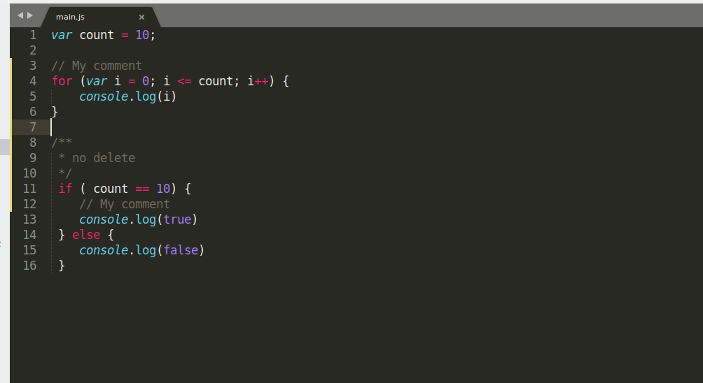
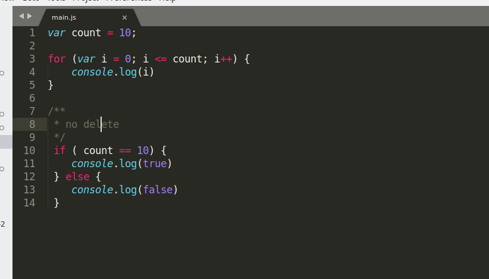

# REPLACER APP
---
###  My app deletes extra comments that begin with the symbol //

## Before


## After


# How to use

```
pip3 instal os
pip3 install sys
```
### Change in main.py array with types to be cleaned

```python
types = ["js", "php", ...]
```

and run `python3 main.py` in terminal(if you use linux).